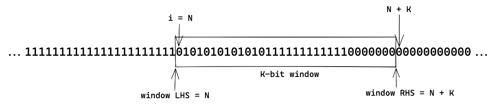
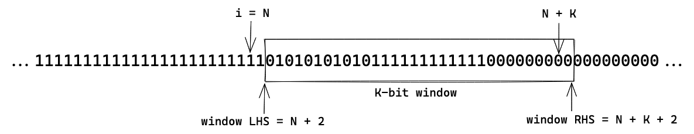

# Summary

Sequence numbers today provide a simple replay prevention mechanism for transactions — only a single transaction can ever be processed for a given sequence number/account combination. Additionally, the sequence number provides a way of enforcing sequentiality; a sender can send transactions with sequence numbers 0, 1, 2, and 3 to the network in any order since the sender knows that 1 can only be processed after 0, 2 after 1, etc.

However, sequence numbers today present issues due to sequence number lockup: once a transaction at a given sequence number n is chosen, the sending account will block on being able to process other transactions with sequence numbers greater than n until that transaction has been processed.  This limitation has cropped up in multiple places so far and in general will be an issue when any off-chain activity related to signing a full transaction is being considered.

## Use Cases and Motivation

### Services with Human Approval Flows

If a service has an approval flow with humans in the loop it can possibly take quite a while from the creation of the transaction to approval and transmission to the network (minutes to hours, possibly even days). Because of this, while sequence numbers can prevent duplicate transactions sent from the service, they are not able to prevent replay of transactions from within the (off-chain) approval flow without causing a head-of-line blocker: once a sequence number has been assigned to a transaction the service must block on processing all transactions with a sequence number greater than n once a transaction with that sequence number has been sent out for approval, unless it wishes to invalidate that transaction.

### Custodial Services and VASPS

Many VASPs--especially those using the omnibus model--share a similar issue to the issue presented above wherein only a single sequence number can be used for a given account at any time. However, whereas the sequence number is pre-assigned while a human is in the loop above, in this case a sequence number is assigned once it receives a validated request from an appropriate client and verifies that a past transaction is not being maliciously replayed. Once this check is done, a sequence number is assigned to the transaction and this payload is sent to the VASPs HSM to sign the transaction before being broadcast on the chain. In this time window where the VASP is waiting for successful confirmation of the transaction, the VASP blocks on the confirmation and cannot assign a new sequence number for the same account unless they were to support pipelining with more complex error-handling.

### Multi-Agent Transactions

A similar case presents itself in multi-agent transactions (proposed in [DIP-169](https://github.com/diem/dip/blob/main/dips/dip-169.md)): if a transaction **A** with sequence number n between parties **a, b,** and **c** is being signed (with primary sender **a**) then **a** cannot send, and have processed, any transactions with sequence number greater than n until **A** has been signed and sent by all parties. However, this could lead to **a** blocking for quite a while, or needing to invalidate **A** in order to unblock their account. This presents serious usability concerns if we wish multi-agent transactions to be useable as part of common off-chain protocols.

### High-Frequency Transactions

If an account is issuing a high number of transactions, blocking on other transactions to process in order to send/process their transaction before sending another presents a number of issues if, e.g., the sender's wallet is sharded or distributed across multiple different nodes. Purely sequential sequence numbers prohibit concurrently processing multiple transactions in this setting and recovering from any one transaction being possibly rejected since future transactions that have already been sent to the network will block until a new transaction has been sent and processed by the network.

In general we have observed a theme with sequence numbers: they prevent replays, and ensure strict sequentiality, however this "strict sequentiality" presents serious usability issues for off-chain protocols.  This proposal would introduce the idea of a Conflict-Resistant Sequence Number (CRSN) in the system that relaxes this strict sequentiality to allow concurrent processing of transactions while also allowing some level of dependency between transactions sent by the same account to be expressed.

# Requirements

A CRSN must satisfy the following requirements:

1. **Non-Replayability:** Multiple transactions sent with the same sequence nonce (CRSN) and address pair should conflict with each other.
2. **Concurrency:** Multiple transactions should be able to be in-flight at the same time, and can be processed in any order with a CRSN.
3. **Force Expiration:** It must be hard to accidentally invalidate a given CRSN and sequence nonce pair without processing a transaction that this pair is associated with. E.g., you should only be able to expire a transaction knowingly, by sending another transaction with the same sequence number/nonce, or by sending a specific transaction to expire a transaction. A transaction should never expire as a result of another transaction with a different sequence number/nonce being processed with the exception of a force expiration transaction, as this makes it impossible for mempool to determine when to remove old transactions that can no longer be processed.
4. **Dependency:** Dependency (but not strict sequentiality) must be able to be expressed between two transactions. e.g., an account should be able to guarantee that `txn2` will not be executed before `txn1` by some other means than waiting for `txn1` to be executed and committed before submitting `txn2`.
5. **Space:** The representation of the CRSN must have a constant-size space footprint.
6. **Opt-in:** Using a CRSN must be opt-in at the account level. The system must be able to support accounts with normal sequence numbers and other accounts with CRSNs coexisting in the network.

# CRSN Definition

We define a CRSN as follows. A CRSN `CRSN(k)` is a stateful object published under an account `A` and parameterized by a bounded number `k`. `CRSN(k)` holds two pieces of data:

* A `min_nonce: u64` field
* A `slots: [bool; k]` field consisting of `k` boolean slots initialized to `false`.

Each transaction sent from `A` is assigned a number or *sequence nonce* `i: u64`. This number coupled with the state `CRSN(k)` held under `A` defines the acceptance and rejection criteria for transactions.

## Acceptance and Rejection Criteria

The acceptance and rejection criteria for a pair `(i, CRSN(k))` where `i` is the sequence nonce assigned to a transaction sent by `A` and `CRSN(k)` is the CRSN state under `A` at the time of processing is as follows:

1. If `i` is greater than or equal to `CRSN(k).min_nonce + k` the transaction    is discarded.
2. If `i` is less than `CRSN(k).min_nonce` the transaction is discarded.
3. If `i` is greater than or equal to `CRSN(k).min_nonce` and less than    `CRSN(k).min_nonce + k` then
    1.  If the slot at position `i` in `CRSN(k).slots` is `false` then `CRSN(k).slots[i]` is set to `true` and the transaction is accepted. Subsequently, the [shifting algorithm](#shifting-algorithm) is applied to `CRSN(k)`. `A`'s sequence number is incremented.
    2. If the slot at position `i` in `CRSN(k).slots` is `true` the transaction is rejected.

It is worth noting, that under the above definitions that the semantics of `CRSN(1)` match the semantics of sequence numbers. Additionally, the above acceptance and rejection criteria maintain the invariant that for all accounts (CRSN or not) that for all accounts `A`, `A.sequence_number == <number of transactions sent by A that have been processed>`.

## Shifting algorithm

Let `j = max {m | CRSN(k).min_nonce <= e <= m < k . forall CRSN(k).slots[e] == true }` (i.e., the least index in `CRSN(k).slots` such that all slots less than it are set to `true`).  The following updates are then performed:

* `CRSN(k).min_nonce = CRSN(k).min_nonce + j`
* for all `j <= i < k, ``CRSN(k).slot[i - j] = CRSN(k).slot[i]` and, for all `k - j <= i < k, ``CRSN(k).slot[i] = false`.

As an example, if we have the following CRSN state under a account `A`, where `1` represents `true` and `0` false:

Processing a transaction with a sequence nonce equal to `N` will then cause the above-described shifting algorithm to update the state to the following:

## Sequence number to CRSN transition

An account may send a transaction to switch to usage of a CRSN for transaction replay prevention. Let the sequence number of this transaction sent from account `A` be `s`, and `k` be the specified number of slots for the CRSN. A CRSN `CRSN(k)` will be published under `A` with the following states:

* `CRSN(k).min_nonce = s + 1`
* Every element of `CRSN(k).slots` is initialized to `false`.

## Force Expiration

An account `A` that has opted-in to using a CRSN may force expire either a single sequence nonce, or may expire a batch of sequence nonces. A sequence nonce that has been expired will cause any transactions that have been assigned that sequence nonce to be rejected according to the Acceptance and Rejection Criteria above.

A singular sequence nonce may be expired by a no-op transaction assigned the sequence nonce that is to be expired. This will then perform the actions described in 3(a). Any further transactions assigned this sequence nonce will then be rejected by the Acceptance and Rejection Criteria.

If a range of sequence nonces is to be expired, it can be done so by sending a specific force-expiration transaction — `force_shift(j)` — that contains the amount by which the window should be shifted `j`. This can be informally thought of as incrementing the account's `CRSN(k).min_nonce`  by `j`, and performing a "left shift" on the account's `CRSN(k).slots. `More precisely: let `CRSN(k)` be `A`'s CRSN at the time of processing the `force_shift(j)` transaction and let this transaction be sent with sequence nonce `m`, then the following updates will be performed (in order):

1. `CRSN(k).slots[m]` is set to `true`.
2. `CRSN(k).min_nonce = CRSN(k).min_nonce + j`
3. for all `j <= i < k, ``CRSN(k).slot[i - j] = CRSN(k).slot[i]` and, for all `k - j <= i < k, ``CRSN(k).slot[i] = false`.

It is important to note that the sequence nonce assigned to the `force_shift(j)` transaction must be accepted by the Acceptance and Rejection Criteria in the pre-state in order for these changes to be performed. This does not affect the account's sequence number, and the `force_shift` transaction will increment the sending account's sequence number as defined in the Acceptance and Rejection Criteria.

## Transaction Prioritization & Validation

A transaction will only be allowed into mempool if the transaction's sequence nonce is greater than or equal to the sending account's current `min_nonce`. When validating a transaction immediately before execution, the transaction will be discarded if the sequence nonce provided with the transaction is not accepted according to the Acceptance and Rejection Criteria. With exception of the addition of the CRSN logic and checks determining if the account is using a sequence number or CRSN, transaction validation both when entering the mempool, and before execution is unchanged.

After a transaction using a CRSN has entered mempool, there must be a prioritization mechanism for it when filling a block. Note that while the prioritization criteria are not part of the specification of CRSNs, the following amended rules is the most likely of these for accounts that have opted-in to using a CRSN:

1. Transactions should first be ordered by gas price and sending account role as they are today
2. Amongst equal transactions according to the ordering in (1) ties should be broken for smaller sequence nonces greater than the sending account's current `min_nonce` .
3. Transaction's with a sequence nonce less than the sending account's current `min_nonce` should be cleared from the mempool. A transaction can only enter the state where it needs to be cleared due to force expiration.

# CRSNs Satisfy Requirements

1. **Non-Replayability:** If two transactions are sent from the same account `A` with the same sequence nonce `i` then the latter will be rejected by (3b), or `i` will be less than `A.CRSN(k).min_nonce` and will be rejected by (2).
2. **Concurrency:** Transactions from the same account can be processed concurrently as long as their slot is open in the current state `A.CRSN(k)`.
3. **Force Expiration:** A transaction with sequence nonce `i` can only be expired by processing another transaction with the same sequence nonce, or if a `force_shift` operation is performed. A transaction can't be accidentally expired since the window may only move over filled slots (i.e., processed transactions) or unless a specific force_shift operation is performed by the sender.
4. **Dependency:** Partial dependency between two transactions can be expressed by choosing their sequence nonces to have a difference of at least `k`. Note: this isn't strict sequentiality as other transactions could be processed between the processing of the transaction with sequence nonce `i` and `i + k`.
5. **Space:** `CRSN(k)` takes the size of a `k`-bit bitvector and a 64-bit integer in a resource and does not grow over time. Therefore the space usage is constant.
6. **Opt-in:** Accounts can opt-in or out of using the proposed CRSN as outlined above in the section on transitions.

