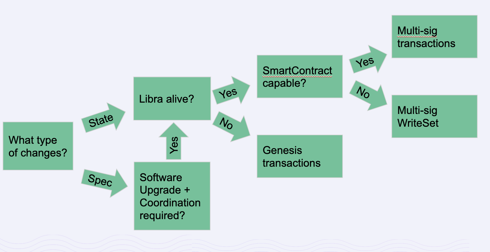

# Introduction
Libra Payment Network ("LPN") is a blockchain-backed payment platform and an infrastructure for stablecoins. Libra Networks ("LN") is a whole subsidiary of the Libra Association. LN is in the process of applying for an LPN payment system license from the Swiss Financial Market Supervisory Authority ("FINMA"). Once granted, LN will be responsible for ensuring that LPN operates in compliance with the payment system license from FINMA.

Libra Upgrade Management (LUM) is a set of protocols to reconfigure the blockchain. With respect to time-sensitive decisions and incident response, LUM provides the Libra Networks with technical means to respond to critical incidents, as necessitated by compliance.

Due to being a reserve backed currency, the true blockchain is the one that is maintained by the Libra Association and reflects the assets in the Libra Reserve. In other words, in contrast to Bitcoin and other “proof of work” and “proof of stake” networks where the miners and users beliefs determine the current fork of the blockchain, with Libra the blockchain used by the Libra Reserve determines the true blockchain. Furthermore, Libra Networks will operate as a regulated payment company under a Swiss license and must be able to enforce its policy and oversight, as well as to respond to critical operational incidents.

The goal of LUM is to provide the means to effectively and transparently update the LPN in order to meet changing requirements as well as remediate any plausible operational incident.

# Building blocks
Conceptually, the software running on validator nodes comprises two layers. One is a blockchain core whose goal is to replicate a ledger of transactions and their outcome. The second is a framework that stores the ledger-state and a set of software modules -- encoded in the Move programming language -- that define the rules for interacting with the LPN and mutating the ledge-state (see also [LIP-2](./lip-2.md)). There are two corresponding types of upgrades to the system, (i) [updates to the core software](#software-upgrade) (ii) [updates to the framework state](#on-chain-state-upgrade).

All building blocks may be used for "business-as-usual" upgrades or to address urgent incidents.

## Software upgrade
Specification changes go through the [LIP process](./lip-0.md) and non-specification changes (e.g. bug fixes and performance improvements) do not need to go through it. All software changes are submitted through standard Github reviews and proceed through the code review process before being merged to master.

In order to release a new version of software, Libra Networks (LN) needs to coordinate the release plan and timeline with all the validator operators. Validator operators are responsible for deploying the software release as per the provided instructions.

Some changes may require all validators to transition at the same blockchain height, which is implemented by [on-chain state update](#on-chain-state-upgrade).

## On-chain state upgrade
On-chain state can only be updated via transactions. We propose three ways to effectuate changes to the LPN by directly mutating on-chain state, ordered by most frequent to least frequent: normal multi-sig transactions, multi-sig WriteSet transactions, and genesis transactions.

### Normal multi-sig transactions
Normal transactions go through the VM and invoke Libra Framework modules (see [LIP-2](./lip-2.md)) to produce a Writeset that alters ledger-state. Both the resulting state change and the authenticating set of signatures are transparent and visible on-chain for auditing.

### Multi-sig WriteSet transactions
Writeset transactions are a special type of multi-sig transactions that prescribes an arbitrary state change. Unlike normal transactions, which must follow rules such as “the reserve is the only entity that can create or destroy money”, WriteSet transactions simply describe a state change rather than go through the Libra Framework modules. This type of transaction is only needed for situations such as updating immutable stdlib libraries due to critical bugs or reversing large scale fraud.

The use of WriteSet transactions follows the spirit of transparency — WriteSet transactions allow an arbitrary change to the state of the blockchain without altering the history of past transactions.
Even though WriteSet transactions prescribe arbitrary state change, they are authenticated with the same multi-sig mechanism as normal transactions which means both the change and multi-sig are transparent and visible on-chain.

### Genesis transactions
Genesis transactions can be either normal or WriteSet transactions. As the name suggests, the process of applying such a transaction is similar to how the very first genesis transaction works. The genesis transaction applies on top of a specific snapshot of a Libra blockchain (might be empty). LN is responsible for picking the appropriate snapshot and building the genesis transactions. Users of Libra including validators use the genesis transaction to authenticate the blockchain. If a validator fails to acquire the correct genesis transaction, it will vote on an irrelevant blockchain, but not otherwise impact the system. If a user of the system acquires the incorrect genesis transaction, they will see incorrect state.

Note that, after Libra starts, we may need genesis transactions as a last resort for extremely unlikely catastrophic scenarios such as losing more than a third validators.

The decision flow chart below summarizes the building blocks and how they will be used.

# Case study

## Network specification upgrade
Example: Changing the wire protocol in a backward compatible way.

Category: Spec change => Software upgrade
## On-chain config update
Example: Adding new validators to the system.

Category: On-chain state change => Multi-sig transaction
## VM upgrade
Example: New bytecode added.

Category: Spec change + require coordination => Software upgrade + Multi-sig transaction
## Consensus protocol upgrade
Example: Switching consensus algorithm from LibraBFTv3 to LibraBFTv4.

Category: Spec change + require coordination => Software upgrade + Multi-sig transaction
## Signature scheme change
Example: Switching consensus signature scheme from EdDSA to BLS.

Category: Spec change + require coordination => Software upgrade + Multi-sig transaction
## Smart contract vulnerability fix/Libra Framework upgrade
Example: DAO hack

Category: On-chain state change + SmartContract incapable => Multi-sig WriteSet transaction
## Large fraud
Example: Hackers mint billions of Libra.

Category: On-chain state change + SmartContract incapable => Multi-sig WriteSet transaction
## Quorum Loss
Example: F+1 validators simultaneously quit the Association and stop running their validators

Category: State change and consensus is dead. => Genesis transaction
